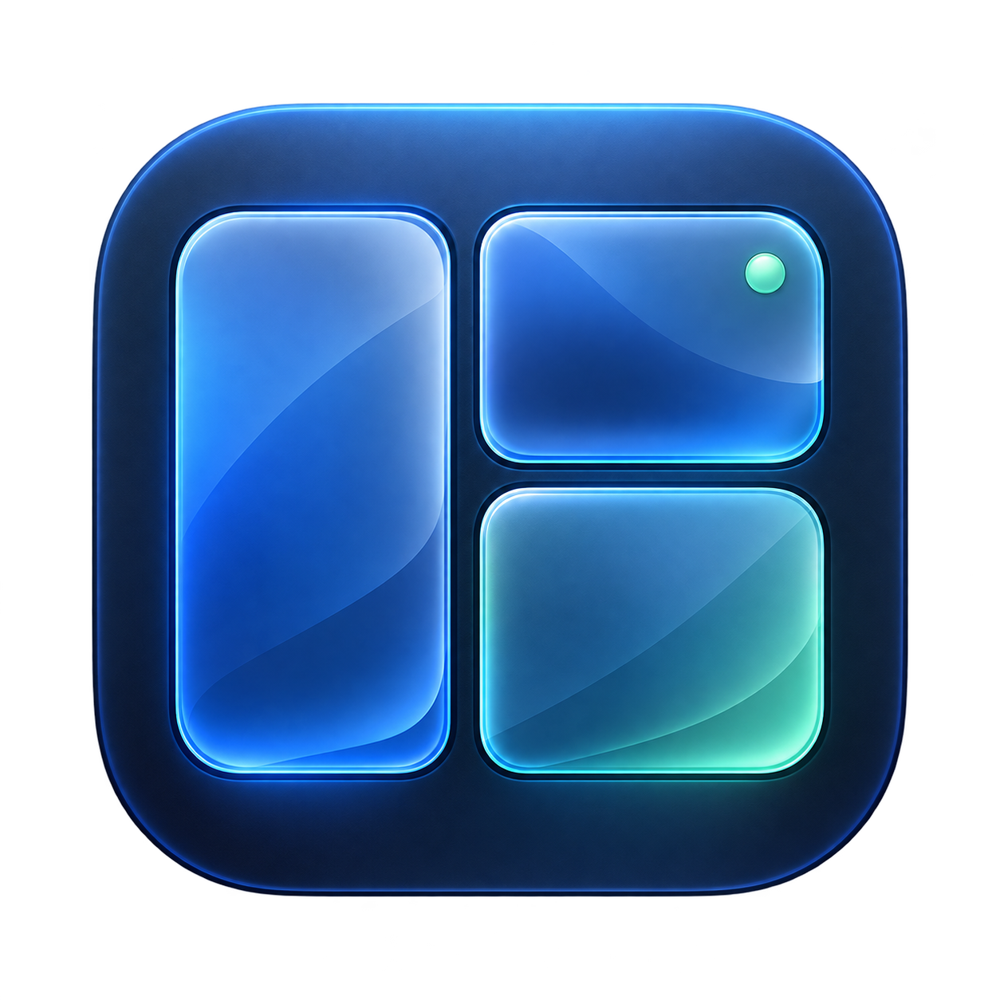
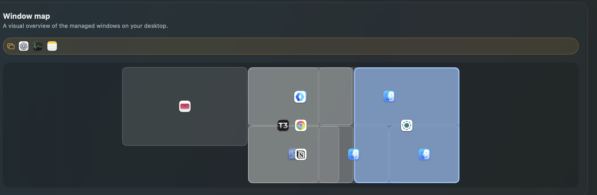
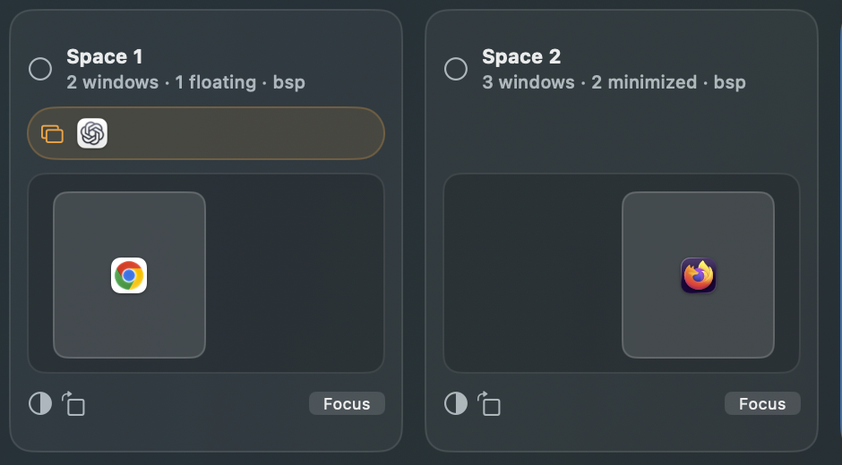

# yabUI

<p align="center">
  
</p>

<h3 align="center">A visual command center for macOS window management.</h3>

<p align="center">
  See your desktop as a map, move windows with intent, and control the service
  from one calm native interface.
</p>

<p align="center">
  <a href="https://github.com/4hmedk/yabUI/releases/latest"></a>
  <a href="https://github.com/4hmedk/yabUI/actions/workflows/release-yabui.yml"></a>
  <a href="https://github.com/4hmedk/yabUI/blob/master/LICENSE.txt"></a>
  
  
</p>

<p align="center">
  <a href="https://github.com/4hmedk/yabUI/releases/latest">Download yabUI</a>
  · <a href="https://github.com/4hmedk/yabUI/releases">View releases</a>
  · <a href="yabUI/README.md">Build from source</a>
</p>

## Overview

yabUI turns spaces, displays, and windows into a compact native macOS surface.
The main app gives you a live workspace map; the menu-bar surface keeps the
same essentials available without opening a terminal or a large window.

<p align="center">
  
</p>

<p align="center"><em>One overview for the windows currently managed on your desktop.</em></p>

The interface is designed around the way a desktop actually feels:

- a unified window map with proportional, non-overlapping tiles
- app icons instead of noisy window-name lists
- click-to-focus behavior for every visible window
- drag-and-drop movement, swapping, splitting, and rebalancing
- reorderable spaces across displays
- a prominent service control in both the app and menu bar
- a transparent activity log for every command sent by the app

## See it in action

<table>
  <tr>
    <td width="50%"></td>
    <td width="50%"></td>
  </tr>
  <tr>
    <td align="center"><sub>Workspace cards turn spaces into an actionable layout.</sub></td>
    <td align="center"><sub>The liquid-glass inspired yabUI identity.</sub></td>
  </tr>
</table>

The workspace surface is intentionally visual: app icons stand in for window
names, tiles preserve approximate proportions, and the active space is easy to
spot at a glance.

## Install

Download the latest `yabUI.dmg` from the [release page](https://github.com/4hmedk/yabUI/releases/latest), open it, and drag `yabUI.app` to Applications.

The app includes a universal window-manager runtime, so a separate command-line
installation is not required. macOS Accessibility permission is required for
window control. Advanced space operations may require the same scripting
permissions as the underlying runtime.

## The app surface

### Overview

The Overview tab shows service health, quick layout controls, recent activity,
open applications, and one unified map of visible windows. A tile keeps the
window's approximate size and layout relationship while remaining readable at
compact sizes.

### Workspace

Workspace is the full editing surface. Drag a window onto another tile:

- center — exchange positions
- left/right/top/bottom — split into that direction
- another space — move the window there

Spaces can be dragged to reorder them or move them between displays. The app
rebalances affected spaces after a move so empty gaps do not linger.

### Menu bar

The menu-bar item opens a proper yabUI surface rather than a plain command menu.
It includes:

- play/pause-style start and stop control
- restart and refresh
- a live compact window map
- click-to-focus tiles
- drag-to-move and drag-to-split tiles
- balance, float/tile, zoom, and rotate actions

## Controls at a glance

| Surface | What it is good for |
| --- | --- |
| Overview | Service health, a unified window map, app inventory, and recent activity |
| Workspace | Drag spaces and window tiles, move windows between spaces, swap, split, and rebalance |
| Menu bar | Start/stop/restart, refresh, quick layout actions, and a compact live map |
| Activity | A transparent command history with success and failure details |

## Build

Requirements: Apple Silicon macOS 26 or newer, Xcode command-line tools, and a
working local checkout of this repository.

```sh
./yabUI/scripts/build_app.sh
./yabUI/scripts/package_dmg.sh
```

Build output is written to `yabUI/dist/`. The build script embeds the universal
runtime found at `/opt/homebrew/bin/yabai`, `/usr/local/bin/yabai`, or
`/usr/bin/yabai`; set `YABAI_BIN` to override that path.

## Repository layout

| Path | Purpose |
| --- | --- |
| `yabUI/Sources/yabUI/` | SwiftUI application source |
| `yabUI/Resources/` | App metadata and icon |
| `yabUI/scripts/` | App and installer build scripts |
| `yabUI/RELEASE_NOTES_*.md` | Release-specific notes |
| `src/`, `examples/`, `doc/` | The bundled window-manager runtime and its reference material |

## Open source and reproducible builds

The app layer and its bundled runtime live in the same repository so releases
can be inspected and rebuilt from source. The SwiftUI product surface is under
`yabUI/`, while the runtime implementation and reference material remain in
the root source tree.

## License

yabUI and the retained runtime source are distributed under the terms in
[`LICENSE.txt`](LICENSE.txt).
